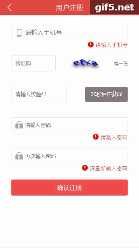
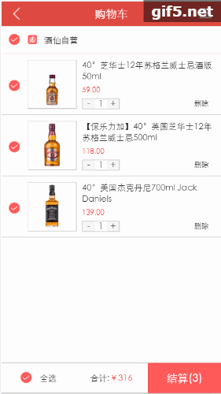

## wangfeixiang

> 酒仙网vue全家桶

1. 使用`mint`组件的下拉加载，无限滚动
2. 使用`axios`全局配置
3. 使用`mock`生成`json`数据
4. 使用`vue-lazyload`实现懒加载
5. 首页动态效果图如下
   > 
6. 注册页面效果图如下
   > 
7. 列表页面效果展示如下
   > 
   ------------------------------------------
   > 
8. 详情页面效果展示如下
   > 
   ------------------------------------------
   > 
9. 购物车页面效果展示如下
   > 
10. 本项目采用vue-cli脚手架，依赖安装`npm install`,启动项目`npm start`或者`npm run dev`

For a detailed explanation on how things work, check out the [guide](http://vuejs-templates.github.io/webpack/) and [docs for vue-loader](http://vuejs.github.io/vue-loader).
